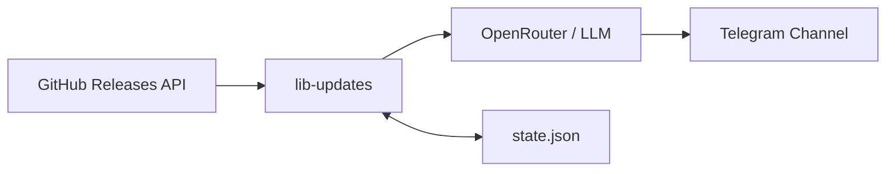

# lib-updates

Keep a pulse on your Python ecosystem. *lib-updates* monitors GitHub releases for your key libraries, summarizes changelogs via LLM (in Ukrainian), and delivers them straight to a Telegram channel — so you never miss a breaking change, security fix, or shiny new feature.



## Features

- **Track any public GitHub repo** — monitor releases for the libraries that matter to you.
- **LLM-powered summaries** — raw changelogs get distilled into 3 concise sentences (Ukrainian) by an LLM via OpenRouter.
- **Persistent state** — knows which releases it's already reported; no duplicate spam.
- **Runs on a loop** — configurable check interval (default 30 min).
- **Zero infra** — single Python process, file-based state, no database needed.

## Quick start

```bash
# 1. Clone & enter
git clone <your-repo>
cd lib-updates

# 2. Install (uv recommended, pip works too)
uv sync
# or: pip install -e .

# 3. Configure environment
cp .env.example .env
```

Edit `.env`:

| Variable              | Description                                   |
|-----------------------|-----------------------------------------------|
| `GH_TOKEN`        | [GitHub PAT](https://github.com/settings/tokens) (public repo access) |
| `BOT_TOKEN`           | Telegram bot token from [@BotFather](https://t.me/BotFather) |
| `CHAT_ID`             | Target chat/channel ID (e.g. `-1001234567890`) |
| `OPENROUTER_API_KEY`  | [OpenRouter API key](https://openrouter.ai/keys) |
| `MODEL`               | Model identifier (e.g. `deepseek/deepseek-v4-flash`) |

```bash
# 4. Run
uv run python main.py
```

## How it works

1. **Check** — fetches the latest release from `https://api.github.com/repos/{owner}/{repo}/releases/latest` for each tracked repo.
2. **Diff** — compares against the last seen tag in `state.json`. New release? Proceed.
3. **Summarize** — feeds the release body to an LLM with a Ukrainian-language summarization prompt.
4. **Deliver** — posts the summary as an HTML-formatted message to the configured Telegram chat.
5. **Persist** — writes the new tag to `state.json` so it won't be reported again.

### Default repos

- `pydantic/pydantic`
- `fastapi/fastapi`
- `sqlalchemy/sqlalchemy`
- `astral-sh/uv`
- `sqlalchemy/alembic`
- `aio-libs/aiobotocore`
- `pytest-dev/pytest`

Easily customized in `main.py` under the `Config` dataclass.

## Project structure

```
lib-updates/
├── main.py                     # Entry point, scheduler, state management
├── settings/
│   ├── __init__.py             # Re-exports
│   └── settings.py             # Environment variable loading
├── services/
│   ├── __init__.py
│   ├── github_connector.py     # GitHub Releases API client
│   ├── llm_connector.py        # OpenRouter LLM summarizer
│   └── tg_sender.py            # Telegram Bot API client
├── state.json                  # Last-seen tag per repo (auto-created)
├── pyproject.toml              # Project metadata & dependencies
├── .env.example                # Environment variable template
└── .gitignore
```

## Local development

```bash
# Install dev dependencies
uv sync --all-extras

# Lint & format
uv run ruff check . --fix
uv run ruff format .

# Type-check
uv run pyright .
```

## Tech stack

| Layer     | Tool                                                                 |
|-----------|----------------------------------------------------------------------|
| Runtime   | Python 3.13+, `asyncio`                                              |
| HTTP      | `aiohttp` — async sessions for GitHub & Telegram                     |

| LLM       | `openai` SDK → OpenRouter API (bring your own model)                 |
| Config    | `dotenv` — `.env` file                                               |
| Quality   | `ruff` (lint/format), `pyright` (type-checking)                      |

## Contributing

PRs welcome. Keep it boring, keep it correct. No database, no docker, no over-engineering.

---

<p align="center"><sub>Built for the Ukrainian Python community. 🇺🇦</sub></p>